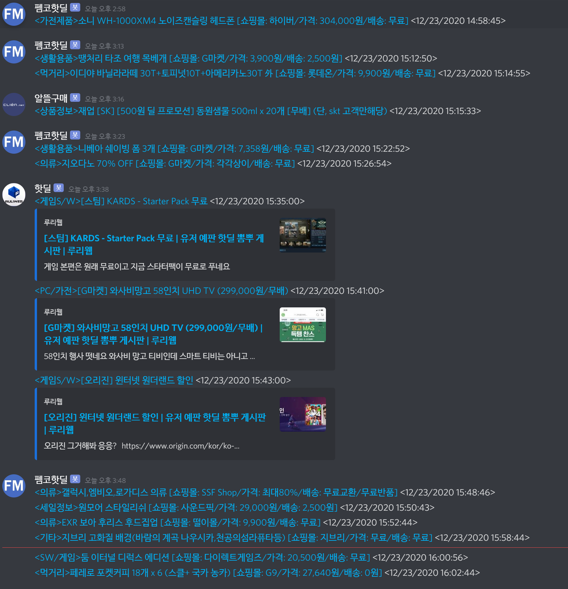
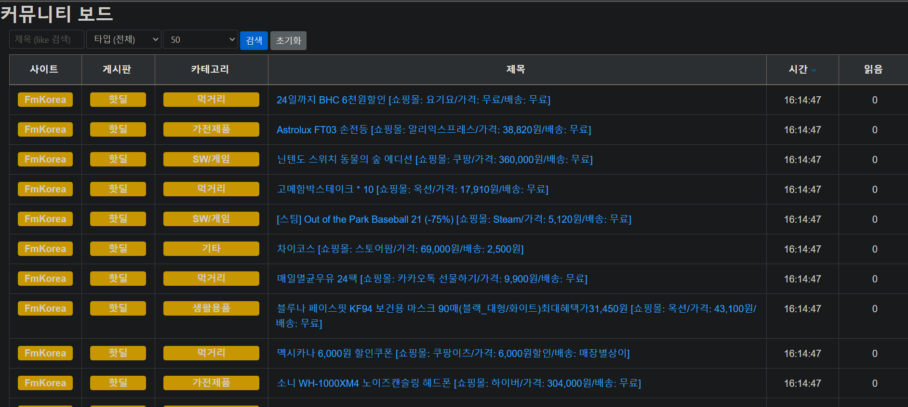

[](https://elky84.github.io)


# web-crawler

* .NET 6, ASP NET CORE 3를 기반으로 작성되었습니다.
* 웹 크롤러로는 [abot2](https://github.com/sjdirect/abot) 를 사용했습니다.
* Feed (RSS) 크롤러로는 [NuGet Gallery | CodeHollow.FeedReader 1.2.1](https://www.nuget.org/packages/CodeHollow.FeedReader/) 사용했습니다.
* 크롤링 대상은 Source로 등록되어야 합니다. [예시](https://github.com/elky84/web-crawler/blob/master/Http/source.http)
  * Source로 등록된 게시판들은 테스트를 거쳐 크롤링 됨을 확인한 사이트와 게시판 들이지만, 규격이 달라져 추가적인 예외처리가 필요할 수 있습니다.
* 알림은 Discord, Slack을 지원합니다. Notification 데이터를, Source와 매핑 시켜서 해당 Source에 새 데이터가 갱신되면 알림이 날라오게 되어있습니다.
* DB로는 mongoDB를 사용합니다.
* API는 swagger를 통해 확인하셔도 좋지만, http 폴더 안에 예제가 포함되어있습니다.
* RSS 알림을 Discord나 Slack으로 전달해주는 기능도 작업이 되어있습니다.
	* Feedly Pro 기능에서만 연동이 가능해서, 직접 RSS 크롤링 & Notification 기능을 만들었습니다.

## 현재 지원중인 크롤링 대상 (사이트)
* Clien
* FmKorea
* 웃긴대학 (HumorUniv)
* Itcm
* 인벤 뉴스 (InvenNews)
* Ppomppu
* Ruliweb
* Slrclub
* 오유 (TodayHumor)

## 각종 API 예시
* VS Code의 RestClient Plugin의 .http 파일용으로 작성
  * <https://marketplace.visualstudio.com/items?itemName=humao.rest-client>
* .http 파일 경로
  * <https://github.com/elky84/web-crawler/tree/master/Http>
* 해당 경로 아래에 .vscode 폴더에 settings.json.sample을 복사해, settings.json으로 변경하면, VSCode로 해당 기능 오픈시 환경에 맞는 URI로 호출 가능하게 됨
  * <https://github.com/elky84/web-crawler/blob/master/Http/.vscode/settings.json.sample>
* Swagger로 확인해도 무방함
  * <http://localhost:5000/swagger/index.html>

## Notification.http 예시

```
### VS Code의 RestClient Plugin의 .http 파일용 서식입니다

### Notification Create Multi Discord

POST {{host}}/Notification/Multi
Content-Type: application/json

{
	"Datas": [{
			"Type": "Discord",
			"Name": "핫딜",
			"IconUrl": "https://lh3.googleusercontent.com/OwN24ti7VzhNXGWVw4RQD-dfkGEf-fnFb7yz--knAwPoxR9VSXpGb3UoOYJNyDIKiQ=s180",
			"HookUrl": "",
			"CrawlingType": "Ruliweb",
			"BoardName": "핫딜게시판"
		},
		{
			"Type": "Discord",
			"Name": "콘솔뉴스",
			"IconUrl": "https://lh3.googleusercontent.com/OwN24ti7VzhNXGWVw4RQD-dfkGEf-fnFb7yz--knAwPoxR9VSXpGb3UoOYJNyDIKiQ=s180",
			"HookUrl": "",
			"CrawlingType": "Ruliweb",
			"BoardName": "콘솔뉴스"
		},
		{
			"Type": "Discord",
			"Name": "PC뉴스",
			"IconUrl": "https://lh3.googleusercontent.com/OwN24ti7VzhNXGWVw4RQD-dfkGEf-fnFb7yz--knAwPoxR9VSXpGb3UoOYJNyDIKiQ=s180",
			"HookUrl": "",
			"CrawlingType": "Ruliweb",
			"BoardName": "PC뉴스"
		},
		{
			"Type": "Discord",
			"Name": "많이 본 글",
			"IconUrl": "https://lh3.googleusercontent.com/OwN24ti7VzhNXGWVw4RQD-dfkGEf-fnFb7yz--knAwPoxR9VSXpGb3UoOYJNyDIKiQ=s180",
			"HookUrl": "",
			"CrawlingType": "Ruliweb",
			"BoardName": "많이 본 글",
			"FilterDayOfWeeks": ["Monday", "Tuesday", "Wednesday", "Thursday", "Friday"],
			"FilterStartTime": "09:00:00",
			"FilterEndTime": "19:00:00"
		},
		{
			"Type": "Discord",
			"Name": "베오베",
			"IconUrl": "https://apprecs.org/ios/images/app-icons/256/6f/664550767.jpg",
			"HookUrl": "",
			"CrawlingType": "TodayHumor",
			"BoardName": "베오베",
			"FilterDayOfWeeks": ["Monday", "Tuesday", "Wednesday", "Thursday", "Friday"],
			"FilterStartTime": "09:00:00",
			"FilterEndTime": "19:00:00"
		},
		{
			"Type": "Discord",
			"Name": "축구 뉴스",
			"IconUrl": "https://media.cdnandroid.com/item_images/1047984/imagen-i-i-i-ee-i-i-i-0thumb.jpeg",
			"HookUrl": "",
			"CrawlingType": "FmKorea",
			"BoardName": "축구 뉴스",
			"Keyword": "토트넘"
		},
		{
			"Type": "Discord",
			"Name": "Rss",
			"IconUrl": "https://www.bruegel.org/wp-content/uploads/2015/08/icon-rss.png",
			"HookUrl": "",
			"CrawlingType": "Rss"
		},
		{
			"Type": "Discord",
			"Name": "LOL 리포터 뉴스",
			"IconUrl": "https://lh3.googleusercontent.com/Hc4D74YO7FYttrPCm5MuDm91NLblaaunJ6Y38WCg9mABUJfobgU_vXy1tjX668bI6xs=s180-rw",
			"HookUrl": "",
			"CrawlingType": "InvenNews",
			"BoardName": "인벤 LOL 뉴스"
		},
		{
			"Type": "Discord",
			"Name": "펨코핫딜",
			"IconUrl": "https://media.cdnandroid.com/item_images/1047984/imagen-i-i-i-ee-i-i-i-0thumb.jpeg",
			"HookUrl": "",
			"CrawlingType": "FmKorea",
			"BoardName": "핫딜"
		},
		{
			"Type": "Discord",
			"Name": "포텐터짐",
			"IconUrl": "https://media.cdnandroid.com/item_images/1047984/imagen-i-i-i-ee-i-i-i-0thumb.jpeg",
			"HookUrl": "",
			"CrawlingType": "FmKorea",
			"BoardName": "포텐터짐",
			"Keyword": "LOL|LCK|DRX|손흥민",
			"FilterDayOfWeeks": ["Monday", "Tuesday", "Wednesday", "Thursday", "Friday"],
			"FilterStartTime": "09:00:00",
			"FilterEndTime": "19:00:00"
		},
		{
			"Type": "Discord",
			"Name": "인기자료",
			"IconUrl": "http://down.humoruniv.com/hwiparambbs/data/pdswait/a_4883065431_b9afd56add3ad86ccc10cde95a0d8c0cc57ead30.png",
			"HookUrl": "",
			"CrawlingType": "HumorUniv",
			"BoardName": "인기자료",
			"FilterDayOfWeeks": ["Monday", "Tuesday", "Wednesday", "Thursday", "Friday"],
			"FilterStartTime": "09:00:00",
			"FilterEndTime": "19:00:00"
		},
		{
			"Type": "Discord",
			"Name": "알뜰구매",
			"IconUrl": "https://cdn.clien.net/web/api/file/F01/2581830/94f801b57da24373a43.PNG",
			"HookUrl": "",
			"CrawlingType": "Clien",
			"BoardName": "알뜰구매"
		},
		{
			"Type": "Discord",
			"Name": "핫딜",
			"IconUrl": "https://steamcdn-a.akamaihd.net/steamcommunity/public/images/avatars/6b/6b9915f60cb45d4df113cd8f36387ba1de8ce601_full.jpg",
			"HookUrl": "",
			"CrawlingType": "Itcm",
			"BoardName": "핫딜"
		}
	]
}
```

## Discord Alert Sample



## Frontend Board Sample


